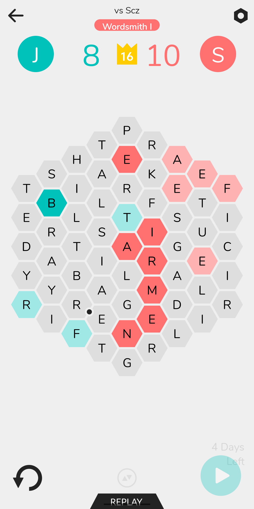
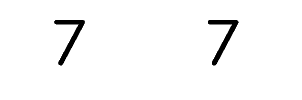

# Hexicon Solver

Solver for the game [Hexicon](https://play.google.com/store/apps/details?id=com.hexicon&hl=en_CA&gl=US).

## Run

```
# Place screenshot of game state in sample.png
yarn
yarn solve
```

## Sample Output


## How it works

Start with a screenshot of the board (only tested with screenshots from my Pixel 3, adjustments will need to be made for screenshots of other resolutions)



### 1. Use OCR to extract the letters

#### 1.1 Crop and increase contrast

```typescript
const imageData = await sharp(filename)
  .extract({ width: 1080, height: 1440, left: 0, top: 360 })
  .greyscale()
  .threshold()
  .toBuffer();
```



#### 1.2 Use Tesseract to run OCR on the image

```typescript
const worker = Tesseract.createWorker({});
await worker.load();
await worker.loadLanguage("eng");
await worker.initialize("eng");
await worker.setParameters({
  // tessedit_pageseg_mode: Tesseract.PSM.AUTO_ONLY,
  tessedit_char_whitelist: "ABCDEFGHIJKLMNOPQRSTUVWXYZ",
});
const output = await worker.recognize(imageData);
await worker.terminate();
return output.data.text;
```

### 2. Extract the colors from the image

#### 2.1 Extract a bunch of color samples

I used a manually constructed set of coordinates to sample a small bit of color (3x3 pixels) from each box, and then simply summed all the data from the area to get a total "color value". Very simplistic, and probably not the best way to do it, but it works. If a value does not match, the program asks the user to fill it in.

```typescript
COORDINATES.map(async (coords, idx) => {
    const imageData = await sharp(filename)
      .extract({
        width: 3,
        height: 3,
        left: coords[0],
        top: coords[1],
      })
      .raw()
      .toBuffer({ resolveWithObject: true });

    const total = imageData.data.reduce((acc, cur) => acc + cur, 0);
```

#### 2.2 Check these samples against some configured mapping

```typescript
// A sample that maps to a color, the Color, and a tolerance for the sample when comparing.
const COLOR_VALUES: [number, Color, number][] = [
  [5994, "none", 10],
  [5499, "red", 10],
  [4329, "very_red", 30],
  [3438, "very_blue", 30],
  [5598, "blue", 30],
];

function isWithin(value: number, target: number, tolerance: number) {
  return value >= target - tolerance && value <= target + tolerance;
}

const color = COLOR_VALUES.find(([value, _color, tolerance]) =>
  isWithin(total, value, tolerance)
);

if (color) {
  return color[1];
} else {
  const newColor = await question(
    `What color is character ${idx + 1} ${total}?`
  );
  switch (newColor) {
    case "red":
      return "red";
    case "blue":
      return "blue";
    case "very_red":
      return "very_red";
    case "very_blue":
      return "very_blue";
    default:
      console.error(`Unknown color ${newColor}`);
      process.exit(1);
  }
}
```

## 3. Construct a graph to represent the board and the connections between the squares

### 3.1 Take the extracted text, which is a series of lines and spaces, and turn it into BoardNode objects

This will also validate that each line has the expected number of characters, and prompt the user for a correction if needed. The OCR tends to miss capital "I" characters, so this correction is necessary.

```typescript
static async create(text: string, colors: Color[]) {
    // validate the text input first
    const linesRaw = text.split("\n").filter((line) => line.length > 0);
    debug("linesRaw", linesRaw);
    if (linesRaw.length !== EXPECTED_LINE_LENGTHS.length) {
      throw new Error(
        `Expected ${EXPECTED_LINE_LENGTHS.length} lines, got ${linesRaw.length}`
      );
    }
    const lines = [] as { char: string; color: Color }[][];

    // Validate each line is the right length, and ask the user
    // to correct any that aren't.
    let colorPosition = 0;
    for (const [idx, lineStr] of linesRaw.entries()) {
      const line = lineStr.split("").filter((word) => word.trim().length > 0);

      if (line.length !== EXPECTED_LINE_LENGTHS[idx]) {
        console.log(
          `Line ${idx} is ${line.length} characters long, expected ${EXPECTED_LINE_LENGTHS[idx]}.`
        );

        const newLine = await question(`Enter new line (got ${line}): `);
        lines[idx] = newLine.split("").map((char) => {
          return {
            char: char.toUpperCase().trim(),
            color: colors[colorPosition++],
          };
        });
      } else {
        lines[idx] = line.map((char) => {
          return {
            char: char.toUpperCase().trim(),
            color: colors[colorPosition++],
          };
        });
      }
    }

    readline.close();

    debug("lines", lines);

    const nodes = lines.map((line, lineNum) =>
      line.map(({ char, color }) => new BoardNode(char, color))
    );

    return this.createFromNodes(nodes);
  }
```

### 3.2 Add the neighbor relationships to the nodes

Depending on where on the board (top triangle, central square, or bottom triangle) there is a slight variance in how to calculate the neighbors, so this logic is segmented across those 3 sections.

```typescript
static createFromNodes(nodes: BoardNode[][]) {
    const boards = new Board(nodes);

    for (const [lineNum, line] of nodes.entries()) {
      debug("lineNum", lineNum);
      for (const [nodeNum, node] of line.entries()) {
        node.setCoords([lineNum, nodeNum]);
        debug("For node: ", node.char);

        // This is the upper area
        if (lineNum < 3) {
          node.addNeighbor(nodes[lineNum + 1]?.[nodeNum]);
          debug(`1. Added ${nodes[lineNum + 1]?.[nodeNum]?.char}`);
          node.addNeighbor(nodes[lineNum + 1]?.[nodeNum + 1]);
          debug(`2. Added ${nodes[lineNum + 1]?.[nodeNum + 1]?.char}`);
          node.addNeighbor(nodes[lineNum + 2]?.[nodeNum + 1]);
          debug(`3. Added ${nodes[lineNum + 2]?.[nodeNum + 1]?.char}`);
        }
        // this is the mid area
        else if (lineNum < 12) {
          if (line.length === 4) {
            node.addNeighbor(nodes[lineNum + 1]?.[nodeNum]);
            debug(`1. Added ${nodes[lineNum + 1][nodeNum]?.char}`);
            node.addNeighbor(nodes[lineNum + 1]?.[nodeNum + 1]);
            debug(`2. Added ${nodes[lineNum + 1][nodeNum + 1]?.char}`);
            node.addNeighbor(nodes[lineNum + 2]?.[nodeNum]);
            debug(`3. Added ${nodes[lineNum + 2][nodeNum]?.char}`);
          } else {
            node.addNeighbor(nodes[lineNum + 1]?.[nodeNum - 1]);
            debug(`1. Added ${nodes[lineNum + 1][nodeNum - 1]?.char}`);
            node.addNeighbor(nodes[lineNum + 1]?.[nodeNum]);
            debug(`2. Added ${nodes[lineNum + 1][nodeNum]?.char}`);
            node.addNeighbor(nodes[lineNum + 2]?.[nodeNum]);
            debug(`3. Added ${nodes[lineNum + 2][nodeNum]?.char}`);
          }
        }
        // this is the lower area
        else {
          node.addNeighbor(nodes[lineNum + 1]?.[nodeNum - 1]);
          debug(`1. Added ${nodes[lineNum + 1]?.[nodeNum - 1]?.char}`);
          node.addNeighbor(nodes[lineNum + 1]?.[nodeNum]);
          debug(`2. Added ${nodes[lineNum + 1]?.[nodeNum]?.char}`);
          node.addNeighbor(nodes[lineNum + 2]?.[nodeNum - 1]);
          debug(`3. Added ${nodes[lineNum + 2]?.[nodeNum - 1]?.char}`);
        }
      }
    }
}
```

### 4. Build a trie out of the word list

A Trie lets us quickly check if a word is in the word list, or if a given string prefix matches any words in the list. This lets us quickly abandon search paths that do not have any results.

```typescript
insert(word: string) {
    let node = this.root; // we start at the root

    // for every character in the word
    for (let i = 0; i < word.length; i++) {
      // check to see if character node exists in children.
      if (!node.children[word[i]]) {
        // if it doesn't exist, we then create it.
        node.children[word[i]] = new TrieNode(word[i], node);
      }

      // proceed to the next depth in the trie.
      node = node.children[word[i]];

      // finally, we check to see if it's the last word.
      if (i == word.length - 1) {
        // if it is, we set the end flag to true.
        node.end = true;
      }
    }
  }

  contains(word: string) {
    let node = this.root;

    // for every character in the word
    for (let i = 0; i < word.length; i++) {
      // check to see if character node exists in children.
      if (node.children[word[i]]) {
        // if it exists, proceed to the next depth of the trie.
        node = node.children[word[i]];
      } else {
        // doesn't exist, return false since it's not a valid word.
        return false;
      }
    }

    // we finished going through all the words, but is it a whole word?
    return node.end;
  }

  containsPrefix(prefix: string) {
    let node = this.root;

    if (prefix.length === 0) {
      return true;
    }

    // for every character in the prefix
    for (let i = 0; i < prefix.length; i++) {
      // make sure prefix actually has words
      if (node.children[prefix[i]]) {
        node = node.children[prefix[i]];
      } else {
        // there's none. just return it.
        return false;
      }
    }

    return true;
  }
```

## 5. Recursively search through the board for words

### 5.1 Using each node in the board as that starting point, try to find words

```typescript
export function findAllWords(board: Board, dictionary: Trie) {
  const words = [] as ReturnType<typeof getWords>;
  for (const line of board.nodes) {
    for (const node of line) {
      debug("Starting at node", node.char, node.coords);
      words.push(...getWords(board, node, [], dictionary));
    }
  }

  return words;
}
```

### 5.2 Use a recursive function to track the current search path and find words

```typescript
// Recursively find the words in the graph
function getWords(
  board: Board,
  node: BoardNode,
  accumulation: BoardNode[],
  dictionary: Trie
): BoardNode[][] {
  // Remember to pop and mark as unused before returning
  accumulation.push(node);
  node.used = true;

  const accumulatedString = getStringFromNodes(accumulation);
  debug(`Working on '${accumulatedString}'`);
  // Check if the trie contains the accumulation
  if (!dictionary.containsPrefix(accumulatedString)) {
    accumulation.pop();
    node.used = false;
    return [];
  }

  const words = [] as BoardNode[][];

  if (dictionary.contains(accumulatedString)) {
    debug("Found word:", accumulatedString);
    words.push([...accumulation]);
  }

  for (const neighbor of node.neighbors) {
    if (
      neighbor.used ||
      neighbor.color === "red" ||
      neighbor.color === "very_red"
    ) {
      continue;
    }
    words.push(...getWords(board, neighbor, accumulation, dictionary));
  }

  accumulation.pop();
  node.used = false;
  return words;
}
```

## 6. Score the words

For each word found, figure out the number of hexagons it will give (red or blue), and the number of squares cleared (red or blue).

```typescript
  countHexagons(word?: Word): {
    redCount: number;
    blueCount: number;
    redCleared: number;
    blueCleared: number;
  } {
    debug("Board");
    debug(printBoard(this, word));
    let redCount = 0;
    let blueCount = 0;
    let blueCleared = 0;
    let redCleared = 0;
    for (const line of this.nodes) {
      for (const node of line) {
        const hexagonResult = node.isCenterOfHexagon(word);

        if (hexagonResult) {
          if (hexagonResult.color === "red") {
            redCount++;
          }
          if (hexagonResult.color === "blue") {
            blueCount++;
          }
          blueCleared += hexagonResult.blueCleared;
          redCleared += hexagonResult.redCleared;
        }
      }
    }
    return {
      redCount,
      blueCount,
      blueCleared,
      redCleared,
    };
  }
```

## 7. Sort the result

Sort based on the difference in number of hexagons (blue - red), maximize the number of red squares cleared, and the length of words.

```typescript
export function sortWords(board: Board, words: Word[]) {
  return words
    .map((w) => {
      const result = board.countHexagons(w);
      return {
        word: w,
        blueHexagons: result.blueCount,
        redHexagons: result.redCount,
        redCleared: result.redCleared,
        blueCleared: result.blueCleared,
      };
    })
    .sort((a, b) => {
      // Sort by the difference in red and blue hexagons
      if (a.redHexagons - a.blueHexagons < b.redHexagons - b.blueHexagons) {
        return -1;
      }
      if (a.redHexagons - a.blueHexagons > b.redHexagons - b.blueHexagons) {
        return 1;
      }

      // Sort by the max number of red squares cleared
      if (a.redCleared > b.redCleared) {
        return -1;
      }
      if (a.redCleared < b.redCleared) {
        return 1;
      }

      // Sort by the minimum number of blue squares cleared
      if (a.blueCleared < b.blueCleared) {
        return -1;
      }
      if (a.blueCleared > b.blueCleared) {
        return 1;
      }

      // Sort by word length
      if (a.word.length > b.word.length) {
        return -1;
      }
      if (a.word.length < b.word.length) {
        return 1;
      }
      return 0;
    });
}
```

## 8. Print the results

Take the results and pretty print them on the terminal

```typescript
export function printWordOnBoard(board: Board, word: BoardNode[]) {
  console.info(chalk.greenBright(word.map((node) => node.char).join("")));

  const letters = [] as string[];

  for (const boardLine of board.nodes) {
    for (const node of boardLine) {
      const index = word.indexOf(node);
      if (index > -1) {
        if (index === 0) {
          letters.push(chalk.greenBright(node.char));
        } else {
          letters.push(chalk.green(node.char));
        }
      } else {
        if (node.color === "red") {
          letters.push(chalk.redBright(node.char));
        } else if (node.color === "very_red") {
          letters.push(chalk.red(node.char));
        } else if (node.color === "blue") {
          letters.push(chalk.blueBright(node.char));
        } else if (node.color === "very_blue") {
          letters.push(chalk.blue(node.char));
        } else {
          letters.push(node.char);
        }
      }
    }
  }

  console.info(boardFromTemplate(letters));
}
```
