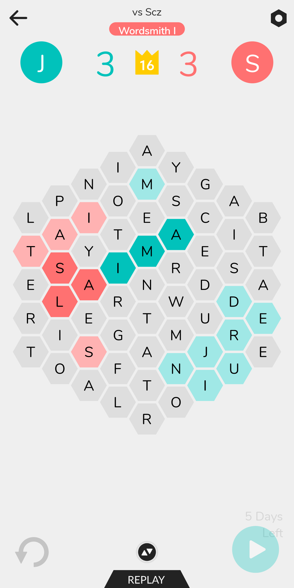

# Hexicon Solver

Solver for the game [Hexicon](https://play.google.com/store/apps/details?id=com.hexicon&hl=en_CA&gl=US).

## Run

```
# Place screenshot of game state in sample.png
yarn
yarn solve
```

## Sample Output


## How it works

Start with a screenshot of the board (only tested with screenshots from my Pixel 3, adjustments will need to be made for screenshots of other resolutions)



### 1. Use OCR to extract the letters

#### 1.1 Crop and increase contrast

See [ocr.ts](ocr.ts).


#### 1.2 Use Tesseract to run OCR on the image

See [ocr.ts](./ocr.ts).

### 2. Extract the colors from the image

#### 2.1 Extract a bunch of color samples

I used a manually constructed set of coordinates to sample a small bit of color (3x3 pixels) from each box, and then simply summed all the data from the area to get a total "color value". Very simplistic, and probably not the best way to do it, but it works. If a value does not match, the program asks the user to fill it in.

See the loop in [extract_colors.ts](./extract_colors.ts).

#### 2.2 Check these samples against some configured mapping

This uses a hand crafted set of values (see `COLOR_VALUES`) and checks each sample against the list. If there is no match, it asks the user to fill in the value.

See the loop in [extract_colors.ts](./extract_colors.ts)

## 3. Construct a graph to represent the board and the connections between the squares

### 3.1 Take the extracted text, which is a series of lines and spaces, and turn it into BoardNode objects

This will also validate that each line has the expected number of characters, and prompt the user for a correction if needed. The OCR tends to miss capital "I" characters, so this correction is necessary.

See `create` in [board.ts](./board.ts).

### 3.2 Add the neighbor relationships to the nodes

Depending on where on the board (top triangle, central square, or bottom triangle) there is a slight variance in how to calculate the neighbors, so this logic is segmented across those 3 sections.

See `createFromNodes` in [board.ts](./board.ts).

### 4. Build a trie out of the word list

A Trie lets us quickly check if a word is in the word list, or if a given string prefix matches any words in the list. This lets us quickly abandon search paths that do not have any results.

See [trie.ts](./trie.ts) for the implementation.

## 5. Recursively search through the board for words

### 5.1 Using each node in the board as that starting point, try to find words

See `findAllWords` in [solve.ts](./solve.ts).

### 5.2 Use a recursive function to track the current search path and find words

See `getWords` in [solve.ts](./solve.ts).

## 6. Score the words

For each word found, figure out the number of hexagons it will give (red or blue), and the number of squares cleared (red or blue).

See `countHexagons` in [board.ts](./board.ts).

## 7. Sort the result

Sort based on the difference in number of hexagons (blue - red), maximize the number of red squares cleared, and the length of words.

See [solve.ts](./solve.ts).

## 8. Print the results

Take the results and pretty print them on the terminal. This uses a hand crafted ASCII grid, and a simple act of splitting/mapping/joining with the letters from the board.

See [format.ts](./format.ts).
